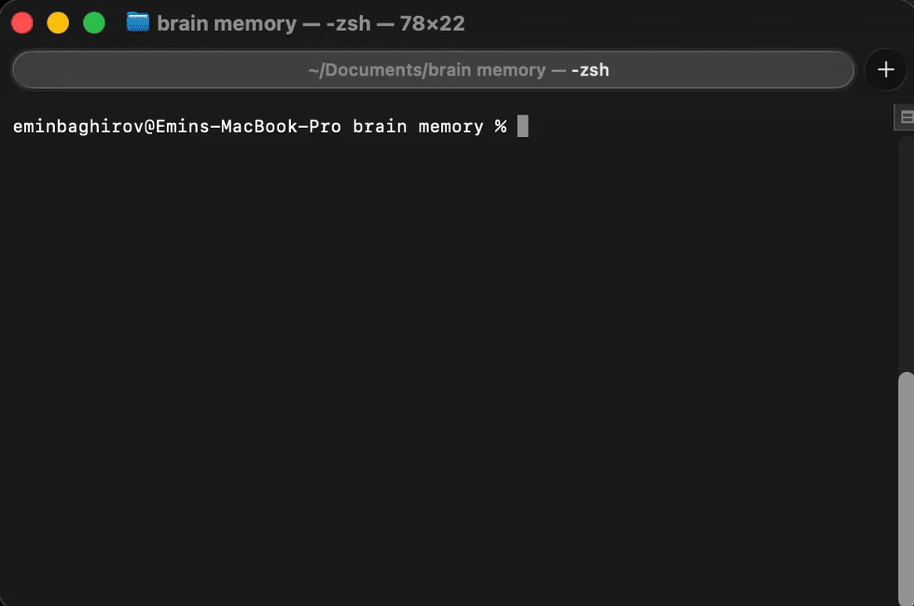

# StateNest

**A local-first memory and control layer for coding agents.**

Install once. Work normally. StateNest remembers the rest.

```bash
npm install -g statenest
statenest setup

cd my-project
claude
```

From here you do nothing. StateNest recognises the repository, restores what you
were doing into the session, records what the session achieved, and syncs that
memory to your other computers through a private git repository **you** own.

No `add`. No `scan`. No `checkpoint`. No `sync`. An ordinary day of development
needs no StateNest commands at all.

> **It syncs its own memory, never your code.** Your source repositories are
> read, never written. There is no account and no service — the remote is a
> private git repository you create.

---

## See it in action

One project. Two machines. No manual StateNest commands between them.



Reproduce it yourself with `npm run demo:zero-touch` — it drives the real hooks
and the real background sync against throwaway fixtures.

---

## What happens automatically

Every row below is current behaviour, not intent.

| When                                     | What StateNest does                                                                                                                               |
| ---------------------------------------- | ------------------------------------------------------------------------------------------------------------------------------------------------- |
| You open Claude Code in a git repository | Works out which project it is from the repository's remote. If it is new, registers it — same name, type and description logic as `statenest add` |
| The same repository on a second machine  | Becomes another **location** of the same project, not a duplicate                                                                                 |
| Session start                            | Injects a short brief: last session, open blockers, next actions                                                                                  |
| Claude Code compacts                     | Turns the summary Claude Code **has already written** into a checkpoint. No second model is ever run                                              |
| Session end                              | Records a metadata checkpoint if the session did work and none was written already                                                                |
| Anything worth sharing is written        | Schedules a background sync, coalescing a burst of writes into one push                                                                           |
| You are offline                          | Everything local keeps working. Nothing waits for the network                                                                                     |
| Two machines change the same record      | Stops, keeps both versions, and leaves your local data usable                                                                                     |

### What is _not_ automatic

This list matters as much as the one above.

- **A repository whose remote is not a hosted one is not auto-registered.**
  Identity is derived from the remote, so a repository with no remote — or one
  pointing at a local path — would get an id that cannot mean the same thing on
  another machine. `statenest add .` registers it, because then you have said so.
- **A directory that is not a git repository is never registered.** Opening
  Claude Code in `~/Downloads` is not a claim that it is a project.
- **Nothing is scanned.** StateNest looks at the repository Claude Code was
  opened in — not its parent, not its siblings, not your home directory.
  `statenest scan` still exists for registering things in bulk, when you ask.
- **A short session that never compacted yields metadata, not meaning.** Branch,
  commit, that work happened — but not what it _meant_. Claude Code's hook data
  does not include per-turn content, and inventing a summary without it would
  mean reading your transcript or running another model. StateNest does neither.
  Run `/statenest:checkpoint` when a short session mattered.
- **There is no daemon.** Sync runs when StateNest or Claude Code is active. A
  machine you never open never syncs.
- **A genuine conflict waits for you.** Nothing is auto-merged, ever.

---

## One project, two computers

```
  MacBook                              Linux workstation
  ~/Projects/harbour                   ~/code/harbour
       │                                      │
   $ claude                                   │
       │  work normally                       │
       │  StateNest captures a checkpoint     │
       │  background sync ──────┐             │
       │                        ▼             │
       │            private git repo you own  │
       │                        │             │
       │                        └──────────▶ $ claude
       │                                      │
       │                              Claude already knows:
       │                                • what was finished on the Mac
       │                                • the open blocker
       │                                • the next action
```

Different paths, different machines, **one project** — because a project's
identity is a hash of its normalised git remote, not its location on disk.

`git@github.com:acme/harbour.git` and `https://github.com/acme/harbour` are the
same project. A repository with no remote gets a random id instead: it works
locally, but it cannot merge with a copy elsewhere, because there is nothing to
match on.

**StateNest does not synchronise your source code.** Git already does that. What
travels is StateNest's own record: progress, decisions, blockers, next actions,
which machines hold the project and where it deploys.

---

## Why StateNest exists

Open a project you last touched three weeks ago and the state you actually need
is nowhere:

- **Where did I stop?** Not in git history — that says what changed, not what it
  was for, or what you were about to do next.
- **Why is it like this?** The decision and its alternatives were in a
  conversation that has been compacted away.
- **Where does this even live?** Which laptop has the working copy, which VPS
  runs it, under what path and service name.
- **What was blocking me?** Recorded nowhere, remembered by nobody.

Your coding agent has the same problem, worse: it starts every session with no
idea what happened in the last one.

StateNest keeps that state in plain YAML and Markdown under `~/.statenest`, and
hands the relevant part to your agent at the moment a session begins.

---

## StateNest vs CLAUDE.md, TODO.md and git

These are not competitors. They answer different questions, and the difference
is stable:

> **`CLAUDE.md` describes how this repository should be worked on.**
> **StateNest records what has happened to this project, and where it exists.**

`CLAUDE.md` is the right home for architecture rules, conventions, build
commands and project instructions. It is committed, reviewed and shared with
your team — which is exactly why it is the wrong place for "I am half way
through the allocator rewrite and blocked on the tide feed".

|                                                | `CLAUDE.md` / `README.md` | `TODO.md`     | git history   | StateNest           |
| ---------------------------------------------- | ------------------------- | ------------- | ------------- | ------------------- |
| Conventions and architecture rules             | **yes**                   | no            | no            | no                  |
| What changed in the code                       | no                        | no            | **yes**       | no                  |
| What you were in the middle of                 | no                        | partly        | no            | **yes**             |
| Why a decision was made, and what was rejected | sometimes                 | no            | sometimes     | **yes**             |
| Current blockers                               | no                        | partly        | no            | **yes**             |
| Which machines hold this project               | no                        | no            | no            | **yes**             |
| Which server it deploys to, and where          | no                        | no            | no            | **yes**             |
| Kept up to date without you editing it         | no                        | no            | n/a           | **yes**             |
| Travels to your other computer                 | with the repo             | with the repo | with the repo | **yes, separately** |

Keep using `CLAUDE.md`. StateNest does not read it, does not replace it, and
does not want to.

The same goes for AI conversation-memory tools: those remember what was _said_.
StateNest records what is **true about your projects and machines right now**,
and most of it is re-derived from disk rather than asserted by a model.

---

## What it remembers

Three kinds of knowledge, with three different levels of confidence — keeping
them apart is the point.

**1. Re-derived from disk, never guessed.** Repository identity, owner and web
URL; the local path and which machine it is on; current branch and HEAD; how
many files are uncommitted; last git activity; ecosystem type and description
from manifests and README.

**2. Captured while an agent worked.** Session activity, and checkpoints written
from the compaction summary Claude Code produces anyway.

**3. Written down deliberately**, by you or your agent: checkpoint narratives,
tasks, decisions with their rejected alternatives, blockers, deployments.

This is a structured record, not an archive. **StateNest does not keep your
conversations**, does not index your codebase, does not watch your filesystem,
and has no vector database.

---

## What StateNest is not

Stated as plainly as what it is, because each of these is a reasonable thing to
assume and all of them are wrong.

- **Not a transcript archive.** It does not store your conversations. The
  checkpoints it writes come from the compaction summary Claude Code has already
  produced, and no second model is ever run.
- **Not a source-code indexer.** It does not read, embed or upload your code. A
  fixed list of manifest files and a README are read for a description; nothing
  else. Search is lexical, over what you wrote down — there is no vector
  database ([ADR 0007](docs/adr/0007-lexical-search-not-embeddings.md)).
- **Not a git replacement.** Git versions your code; StateNest never writes to
  your source repositories. What it syncs is its own memory, separately.
- **Not a hosted service.** There is no StateNest cloud, no account, no sign-up
  and no telemetry. Sync is optional and goes to a private git repository you
  create and own.
- **Not primarily a task manager.** It has tasks, because "what was I about to
  do next" is part of the answer. If a to-do list is what you want, use a to-do
  list.
- **Not a filesystem watcher.** Nothing runs in the background watching your
  disk. There is no daemon at all.

---

## Machines and servers

A **machine** is a computer you work on. A **remote** is a server. A
**deployment** connects a project to one.

```bash
statenest remote add harbour-prod --host harbour.example.com --user deploy --env production
statenest deploy add harbour --remote harbour-prod --path /srv/harbour --service harbour.service
```

**A production server does not need StateNest installed** to be tracked. Register
it as a remote plus a deployment record and StateNest knows where the project
runs, under what path and service, from your laptop.

Install StateNest _on_ a server only when it is a machine you actually develop
on — a dev VPS where you run Claude Code. Then it is simply another machine.

---

## Security boundaries

StateNest reads your home directory, so it should have to earn that.

**Not stored:** your source code; `.env` files or anything inside them; ssh
private keys, passwords or API tokens; raw Claude Code transcripts. There is no
telemetry, and no code in this repository that sends anything anywhere — the
only outbound network operation StateNest performs is git sync, to the remote
you configured.

**Stored:** project names and descriptions; where each project lives on each
machine; branch, commit sha and uncommitted-file counts; checkpoints, decisions,
tasks and blockers; server addresses and deploy paths.

Filenames are checked against a deny-list _before_ a file is opened, project
detection reads only manifests and a README, and everything StateNest writes
passes a secret scanner first. Sync scans again before anything leaves the
machine and refuses to push on a finding — reporting file and line, never the
value. Run `statenest privacy audit` to check for yourself.

### Evidence, not just claims

A README is not proof. These properties are covered by the test suite, which
runs in CI on every commit:

| Property                                                            | Where                                                                                                          |
| ------------------------------------------------------------------- | -------------------------------------------------------------------------------------------------------------- |
| A credential blocks a push; the value never reaches stored state    | [security](tests/integration/security.test.ts), [torture-security](tests/integration/torture-security.test.ts) |
| Source repositories are byte-identical after a session              | [zero-touch](tests/integration/zero-touch.test.ts), [sync](tests/integration/sync.test.ts)                     |
| Two machines converge; one repository stays one project             | [multi-machine](tests/integration/multi-machine.test.ts)                                                       |
| A successful sync leaves its own repository clean                   | [sync-profile-metadata](tests/integration/sync-profile-metadata.test.ts)                                       |
| A conflict preserves both sides and keeps local data usable         | [multi-machine](tests/integration/multi-machine.test.ts), [zero-touch](tests/integration/zero-touch.test.ts)   |
| Offline sessions still start, register and capture                  | [zero-touch](tests/integration/zero-touch.test.ts)                                                             |
| Auto-registration refuses ineligible directories, and scans nothing | [zero-touch](tests/integration/zero-touch.test.ts)                                                             |
| Profiles cannot leak into each other                                | [isolation](tests/integration/isolation.test.ts)                                                               |
| Upgrades do not lose or rewrite data                                | [migration](tests/integration/migration.test.ts)                                                               |

Secret detection is a safety net with documented limits, not a guarantee: it
matches known credential shapes, and a format it does not know will not be
caught. The threat model and its limits are in
[docs/security-model.md](docs/security-model.md).

---

## Claude Code is the first adapter

StateNest's core is agent-independent. It stores and joins project state; it
knows nothing about any particular agent. `src/core/` does not import the Claude
Code integration — only the CLI commands that install and inspect it do.

```
   Claude Code
        │  hooks · MCP tools · skills
        ▼
   ┌──────────────────────────────┐
   │  StateNest core              │
   │  projects · machines         │
   │  checkpoints · decisions     │
   │  deployments · sync          │
   └──────────────────────────────┘
        │
   private git repository you own
```

Claude Code is currently the **only** implemented adapter, and it is a deep one:
five hooks, ten MCP tools and seven skills. The seam other agents would use is
described in [docs/architecture/adapters.md](docs/architecture/adapters.md).
That is a design property, not a promise of other integrations — none exists
today.

---

## Project status

**v0.2.0. Early, and actively dogfooded** across real projects and machines every
day. That is where the bugs come from and how they get found.

- Workflows and interfaces may still change before 1.0.
- The on-disk format may change too. Migrations are provided, applied on read,
  and back up before they write.
- Correctness and data-safety bugs are fixed first and released quickly — the
  v0.1.2 and v0.2.0 changelog entries are examples of exactly that.
- No adoption claims: this is a young project. Please
  [report issues](https://github.com/Emin4ik/StateNest/issues).

What works today, what does not, and the tests behind each claim:
[project status](docs/project-status.md). Platforms, Node and Claude Code
versions, and what is tested versus merely supported:
[compatibility](docs/compatibility.md).

---

## The CLI, when you want to look

**You do not need any of these to make StateNest work.** They are for inspecting
and controlling what it knows.

```bash
statenest recent               # what have I been working on?
statenest resume <project>     # everything needed to pick this back up
statenest projects             # everything it knows about
statenest where <project>      # every copy, every machine, every deployment
statenest status               # active, blocked, stale, uncommitted
statenest search "refinery"    # find that thing you wrote down
statenest sync status          # is everything up to date?
statenest doctor               # check everything, with fixes
statenest dashboard --open     # a local, read-only web view
```

```console
$ statenest resume harbour

harbour
active  ·  3d ago

  Here   ~/Projects/harbour  ·  phase-7  ·  72ba934  ·  8 uncommitted
  Also   workstation  ~/code/harbour

  Recently completed
    • cost-based berth allocation
    • refinery income fix

  Blockers
    • AI fails to rebuild a destroyed refinery

  Next
    1. re-run the winter fixtures
    2. add SAM defensive structures

  Decisions worth knowing
    • Removed the mandatory 15-minute match limit (3 weeks ago)
```

Every command takes `--json`. The full list, with options, is in the
[command reference](docs/command-reference.md).

To watch the whole two-machine flow happen against throwaway fixtures:
`npm run demo:zero-touch` (see [the demo script](docs/demo-script.md)).

---

## Requirements

Node.js 22.12 or newer. Git is optional but strongly recommended — without it,
branch and uncommitted-change information cannot be read. macOS, Linux, Windows
and WSL.

Published through npm Trusted Publishing with provenance:

```bash
npm install statenest@latest
npm audit signatures
```

---

## Documentation

|                                                |                                               |
| ---------------------------------------------- | --------------------------------------------- |
| [Getting started](docs/getting-started.md)     | The short version                             |
| [User guide](docs/user-guide.md)               | The mental model, and what happens on its own |
| [Command reference](docs/command-reference.md) | Every command and option                      |
| [Claude Code](docs/claude-code.md)             | Hooks, MCP tools, skills, latency             |
| [Multi-machine](docs/multi-machine.md)         | Two computers, servers, sync                  |
| [Security model](docs/security-model.md)       | Threat model and its limits                   |
| [Data model](docs/data-model.md)               | Every file and field on disk                  |
| [Architecture](docs/architecture/overview.md)  | How it is put together                        |
| [Positioning](docs/positioning.md)             | How to describe StateNest accurately          |
| [Project status](docs/project-status.md)       | What works, what does not, with evidence      |
| [Compatibility](docs/compatibility.md)         | Tested, supported and untested                |
| [Troubleshooting](docs/troubleshooting.md)     | When something is wrong                       |

Agents and AI assistants: [llms.txt](llms.txt) is a short, curated entry point to
the above.

---

## Contributing

See [CONTRIBUTING.md](CONTRIBUTING.md). Bug reports about data loss, sync
correctness or privacy are the most valuable thing you can send.

## License

MIT — see [LICENSE](LICENSE).
